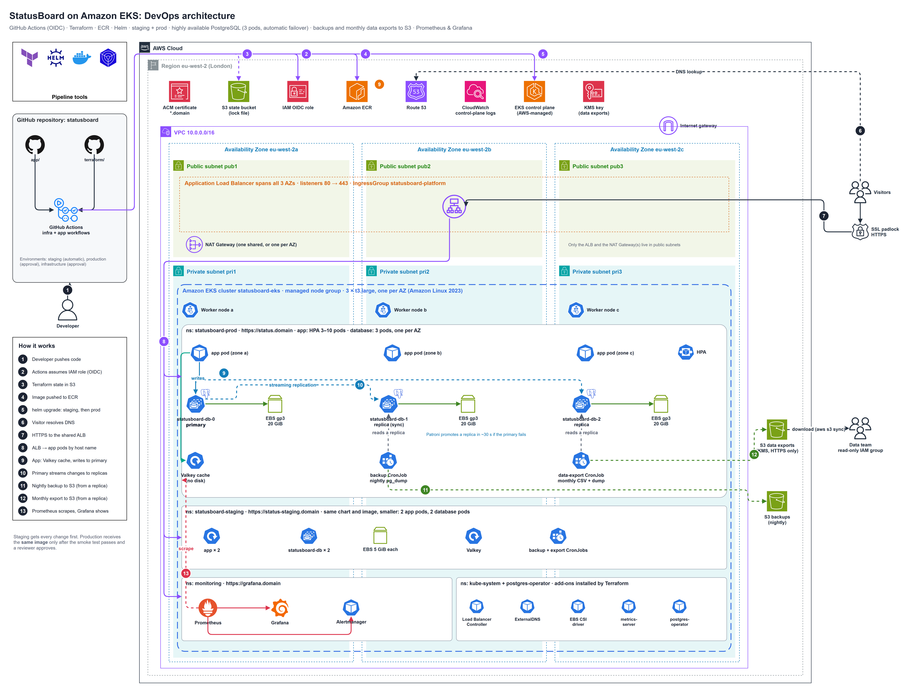

# StatusBoard on Amazon EKS: Terraform

Infrastructure as code for the StatusBoard project: **EKS, ECR, AWS Load Balancer Controller, ExternalDNS, Prometheus and Grafana**, the **Zalando postgres-operator** for highly available PostgreSQL, plus **staging and production environments** (namespaces, an S3 backup bucket, a KMS-encrypted data-exports bucket, least-privilege roles and a read-only data team group). Everything is delivered by **GitHub Actions** with OIDC, so no AWS keys are stored in GitHub.



Step-by-step guide: **`../docs/StatusBoard-EKS-Deployment-Guide.docx`**. It explains every step in plain English and covers costs, teardown, troubleshooting and the limits of this design.

## Diagrams

Every picture lives in [`architecture/`](../architecture/) as a PNG to view and a **draw.io** file to edit. Open the `.drawio` file at <https://app.diagrams.net> or in the draw.io desktop app.

| Diagram | What it shows |
|---|---|
| [`statusboard-devops-architecture`](../architecture/statusboard-devops-architecture.png) | The whole platform: GitHub Actions, AWS services, the VPC across 3 Availability Zones, and one EKS cluster with the prod and staging namespaces, monitoring and add-ons. Numbered arrows follow a change from `git push` to a running pod, and a backup to S3. |
| [`statusboard-system-architecture`](../architecture/statusboard-system-architecture.png) | The same platform as layers: users and DNS, the edge (ALB + TLS), the application (Go pods, Valkey, PostgreSQL), data and backups, and monitoring. |
| [`statusboard-app-data-flow`](../architecture/statusboard-app-data-flow.png) | What happens when a visitor reads the page (cache first) and when an engineer updates an incident (write to PostgreSQL, then clear the cache). |
| [`statusboard-cicd-pipeline`](../architecture/statusboard-cicd-pipeline.png) | Both GitHub Actions workflows: Terraform plan/apply, and test → build → scan → push → staging → smoke test → approval → production. |

## Layout (same structure as the sock-shop project)

```text
create-remote-state.sh     creates the S3 state bucket, then applies bootstrap/
destroy-remote-state.sh    destroys bootstrap/ and deletes the bucket (run last)
main.tf / provider.tf / variable.tf / output.tf
bootstrap/                 GitHub OIDC provider + IAM role, wildcard ACM certificate
module/vpc                 VPC, 3 public + 3 private subnets, NAT (shared or one per AZ), ELB subnet tags
module/eks                 EKS cluster, managed node group, add-ons, access entries, EBS CSI (Pod Identity)
module/ecr                 ECR repository with scan-on-push and lifecycle policy
module/eks-addons          Load Balancer Controller, ExternalDNS, metrics-server, gp3 StorageClass
module/monitoring          kube-prometheus-stack (Prometheus, Grafana, Alertmanager)
module/postgres-operator   Zalando postgres-operator 2.0 (PostgreSQL + Patroni, zone anti-affinity,
                           never deletes database disks or passwords by itself)
module/app-environments    statusboard-staging + statusboard-prod namespaces, S3 backup bucket,
                           per-environment backup IAM roles linked with EKS Pod Identity;
                           exports.tf: KMS key, HTTPS-only exports bucket, export roles, data team group
```

The workflows are in [`../.github/workflows`](../.github/workflows) (this folder's parent is the repository root): `statusboard-infra.yml` (Terraform) and `statusboard-app.yml` (test, build, scan, push, deploy to staging, approval, deploy to production). Both deployments use the shared steps in [`../.github/actions/statusboard-deploy`](../.github/actions/statusboard-deploy).

## Quick start

```bash
# 1. change bucket name, domain, github_repository, admin ARN (see guide)
./create-remote-state.sh                 # prints the role ARN for GitHub

# 2. GitHub: secrets AWS_ROLE_ARN, GRAFANA_ADMIN_PASSWORD; variable DOMAIN_NAME;
#    environments "staging" (no rules), "production" and "infrastructure" (required reviewers)

# 3. Actions: "StatusBoard Infrastructure" (apply), then "StatusBoard Application"
```

Or run locally:

```bash
export TF_VAR_grafana_admin_password='...'
terraform init && terraform plan -out tfplan && terraform apply tfplan
aws eks update-kubeconfig --name statusboard-eks --region eu-west-2
```

## Useful variables

| Variable | Default | Meaning |
|---|---|---|
| `environments` | `staging` (7-day backups), `prod` (30-day backups) | One namespace, backup folder and backup role per entry |
| `data_team_user_names` | `[]` | IAM users allowed to download production data exports (read-only) |
| `nat_gateway_per_az` | `false` | `true` = one NAT Gateway per Availability Zone (survives a zone outage, about USD 70 a month more) |
| `node_instance_types` | `["t3.large"]` | Worker server size |
| `expose_prometheus` | `false` | Prometheus has no login page; keep it private unless you add authentication |

## Outputs

`configure_kubectl`, `ecr_repository_url`, `statusboard_urls` (staging and prod), `backup_bucket`, `exports_bucket`, `data_team_download_command`, `data_team_group`, `namespaces`, `grafana_url`, `prometheus_url` (port-forward command by default).

## Teardown

Run the infra workflow with `destroy`. It uninstalls StatusBoard from both namespaces, deletes the PostgreSQL clusters, their disks and the monitoring stack first. Then run `./destroy-remote-state.sh`.

State locking uses `use_lockfile = true` (Terraform 1.10+): there is no DynamoDB table to manage.
